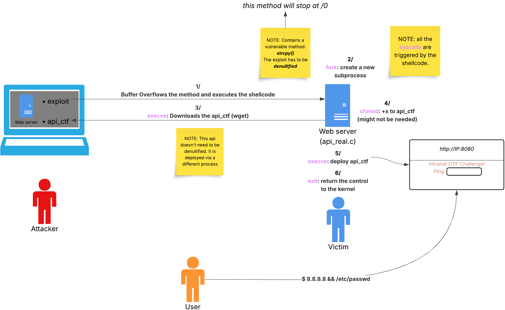

# Not That Funny, CTF

## Purpose

NTFCTF is a binary exploitation lab focused on a Raspberry/ARM stack-overflow scenario and practical payload delivery. It provides source code, binaries, shellcode, and exploit scripts so learners can reproduce the full attack chain in a controlled environment.

## Repository Layout

- `raspberry-exploit/src/`: Vulnerable service sources (`api_real.c`, `api_ctf.c`).
- `raspberry-exploit/bin/`: Binary artifacts (`api_ctf`).
- `raspberry-exploit/exploit/`: Exploit payload script (`exploit.py`).
- `raspberry-exploit/shellcode/`: Shellcode sources.
- `raspberry-exploit/docs/`: Detailed write-up.
- `raspberry-exploit/evidence/`: Recorded execution evidence (`NTFCTF.mov`).
- `assets/`: Visual references (`overview.png`, `stack_overflow.png`, `shellcode_stack_manipulation.png`).

## Overview Diagram



The overview diagram shows the sequence from payload generation on the host to code execution in the vulnerable Raspberry service. It also maps the final deployment step where the challenge service is exposed on port 8080 after successful exploitation.

## How To Test

### 1. Host: serve files from `src` on port 8000

```bash
cd raspberry-exploit/src
python3 -m http.server 8000
```

### 2. Raspberry: build and run `api_real` under gdb

```bash
cd raspberry-exploit/src
gcc -g -fno-stack-protector -z execstack -no-pie -o api_real api_real.c
gdb ./api_real
```

Inside gdb, start the service:

```gdb
run
```

### 3. Host: launch the exploit payload against port 8888

```bash
cd raspberry-exploit/exploit
(python3 exploit.py; cat) | nc 127.0.0.1 8888
```

### 4. Ensure port forwarding to 8080 (from host)

Host-side local SSH forwarding is usually the easiest option. Run this on the host machine so the deployed challenge service on Raspberry is reachable at localhost:8080:

```bash
ssh -L 8080:127.0.0.1:8080 <user>@<raspberry-ip>
```

Confirm port 8080 is allowed by host firewall/network policy before testing.

### 5. Validate service is reachable on host

```bash
curl http://127.0.0.1:8080
```

If exploitation and forwarding are successful, you should receive a response from the deployed challenge service.
